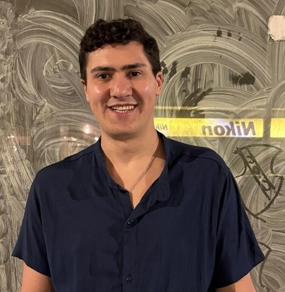

# 👒 El One Piece

Repositorio del equipo **"El One Piece"** correspondiente a las prácticas, ejercicios y trabajos prácticos de la materia **Paradigma Orientado a Objetos** de la carrera de Ingeniería en Informática (UADE).

## Datos de la Materia
* **Materia:** Paradigma Orientado a Objetos (POO)
* **Profesor:** Pablo Hernandez
* **Año / Cuatrimestre:** 2026 - 2° Cuatrimestre

---

## Integrantes

### Matías Torres

* **Objetivos:** Terminar de incorporar sólidamente los conceptos de POO y dominar Java, aplicando buenas prácticas.
* **Conocimientos:** Python, Java, SQL, Excel avanzado, administración de sistemas (Red Hat) y manejo de máquinas virtuales (VMware).
* **Gustos:**  Natación, Fórmula 1, lectura de ficción, proyectos en Arduino.
* **Logros:** Obtener el segundo lugar en la Copa de Algoritmia de la universidad, estar cursando el segundo año de Ingeniería en Informática, desarrollo de un bot de inversiones programado en Python

### Santiago Villavedra

* **Objetivos:** Trabajar a corto plazo de modo que tenga un sueldo estable y promedio.
* **Conocimientos:** Comprensión general del Paradigma de la orientación a Objetos; buen entendimiento de estadística, probabilidad y funciones matemáticas; comprensión de patrones de diseño.
* **Gustos:** Cómics (Marvel, DC, Invencible, etc.), juegos, mangas, animes y series de animación.
* **Logros:** Haber participado en la creación de un complemento de Word para los servicios de la empresa Legal Talent.

###  Yamil Alcaide

* **Objetivos:** Estudiar Licenciatura en Gestión de TI en UADE con el objetivo de poder dedicarme a tiempo completo al área tecnológica.
* **Conocimientos:** Python, HTML, JavaScript, C++ y diseño HTML.
* **Gustos:** El área tecnológica en general, que siempre fue de mi interés y a lo que me gustaría dedicarme cuando trabaje.
* **Logros:** Secundaria con título en informática, certificación de diseño HTML y 2 años de experiencia estudiando Ingeniería en Sistemas en la UTN.

### Ian Miguez

* **Objetivos:** Adquirir experiencia profesional, aplicar lo que aprendo en la carrera y seguir aprendiendo dentro de un equipo de trabajo.
* **Conocimientos:** Python, JAVA, Excel básico y Redes.
* **Gustos:** Videojuegos, deportes, programación y redes.
* **Logros:** Participar de la Copa de Algoritmia en UADE 2025, llegando a la instancia final.

### Emiliano Esponda

* **Objetivos:** Terminar la carrera y trabajar en el área.
* **Conocimientos:** Manejo básico de Bash e ingeniería de requerimientos, y sé bastante sobre componentes de PC (marcas y modelos).
* **Gustos:** Me gusta ver series, jugar videojuegos solo y con amigos, juntarme con ellos y hacer ejercicio. También disfruto leer e informarme sobre los cambios en las tendencias de los componentes de PC (modelos, arquitecturas, nuevos procesos de fabricación y, en general, todas las novedades de este tema).
* **Logros:** Tuve un buen rendimiento en la escuela secundaria y fui abanderado, además de haber recibido múltiples diplomas académicos.
---

## Bitácora de Clases y Avances del Equipo
* **10-08-26** - Ejercicios propuestos de IfElse.