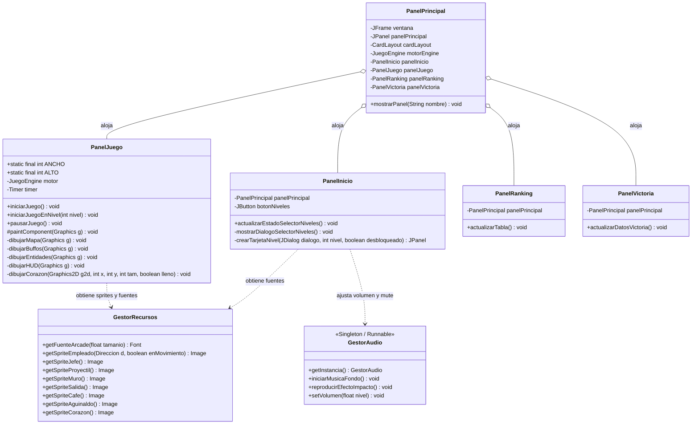
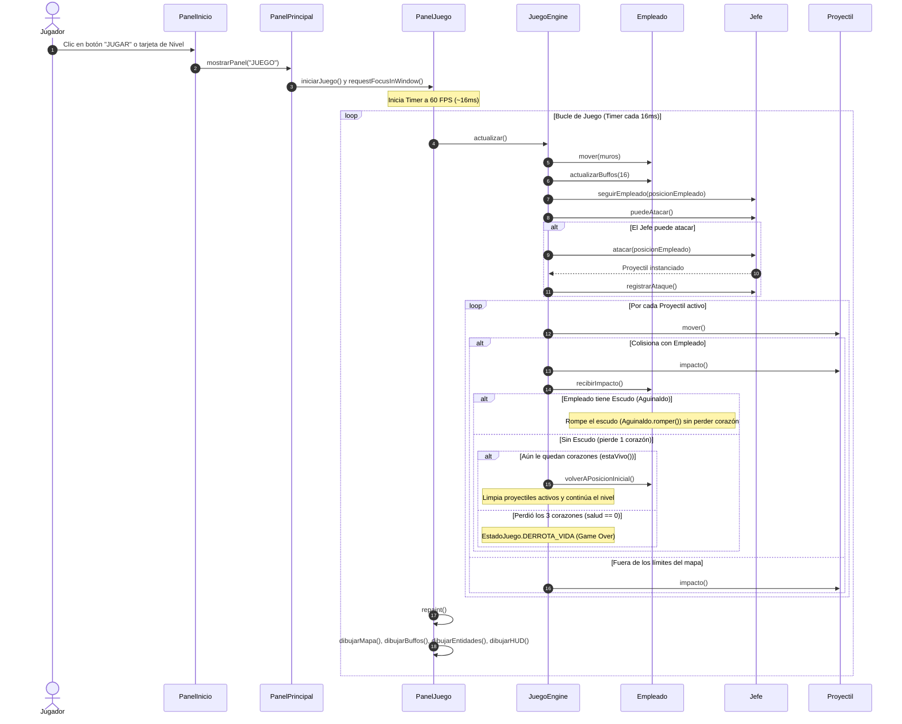

# Escape Corporativo: La Fuga del Empleado

**Trabajo Práctico Obligatorio — Paradigma Orientado a Objetos (POO)**  
*Universidad Argentina de la Empresa (UADE) — Facultad de Ingeniería y Ciencias Exactas*

---

## Información General

| Campo | Detalle |
|---|---|
| **Materia** | Paradigma Orientado a Objetos (3.4.208) |
| **Carrera** | Ingeniería en Informática / Gestión de TI |
| **Profesor** | Hernández, Pablo Eduardo |
| **Período** | 2do Cuatrimestre 2026 |
| **Equipo** | El One Piece (Grupo 1) |
| **Repositorio** | [El-One-Piece-POO](https://github.com/EspondaEmiliano/El-One-Piece-POO) |

### Integrantes

- **Alcaide, Yamil**
- **Esponda, Emiliano**
- **Miguez, Ian Franco**
- **Torres, Matías**
- **Villavedra, Santiago Martín**

---

## Descripción del Juego

**Escape Corporativo: La Fuga del Empleado** es un videojuego 2D de acción y estrategia en tiempo real desarrollado íntegramente en **Java**.

### Premisa Narrativa
El jugador encarna a un empleado exhausto atrapado en un ambiente corporativo opresivo. Su misión principal es escapar de la oficina antes de que venza su horario laboral reglamentario (**60 segundos por nivel**). Durante su huida a través de los **4 niveles** de la corporación, deberá evadir incansablemente a su **Jefe**, un antagonista impulsado por IA que patrulla el corredor superior e intenta adjudicarle horas extra arrojándole proyectiles cargados de tareas y trabajo pendiente (palas).

### Objetivo
Guiar al **Empleado** desplazándose en cuatro direcciones cardinales (`WASD` o flechas direccionales) desde su escritorio inicial hasta la **Salida Principal** (`Salida`) a través de una secuencia de 4 laberintos de dificultad incremental, esquivando proyectiles, recolectando potenciadores estratégicos (*buffos*: **Café**, **Aguinaldo** y **Corazón**) y administrando sus **3 corazones de vida** y el reloj de la jornada.

#### Condiciones de Victoria
- **Salida alcanzada (`EstadoJuego.VICTORIA`):** El jugador superpone su caja de colisión con la Salida Principal antes de que finalicen los 60 segundos del nivel.
- **Bonificación por nivel (`calcularBonificacionVictoria()`):** Al superar cada piso se otorgan `500 pts` base + `segundosRestantes * 10` + `corazonesRestantes * 100` + `250 pts` extra si el empleado cruza la meta conservando su escudo activo.
- **Desbloqueo progresivo y Victoria Final:** Cada nivel superado desbloquea el siguiente piso en el **Selector de Niveles Arcade** del menú principal. Al completar el Nivel 4, se despliega el `PanelVictoria` y se registra el puntaje consolidado en el **Top 10 High Scores**.

#### Condiciones de Derrota
- **Agotamiento de corazones (`EstadoJuego.DERROTA_VIDA`):** El empleado cuenta con **3 corazones** (`SALUD_DEFAULT = 3`) para toda la partida:
  - Si un proyectil impacta al empleado mientras tiene un **Escudo Protector (`Aguinaldo`)** activo, el escudo absorbe el golpe y se rompe (`romper()`), sin perder corazones ni retroceder.
  - Si un proyectil impacta al empleado **sin escudo**, pierde **1 corazón**. Si aún le quedan corazones (`2` o `1`), el Jefe lo devuelve inmediatamente a la casilla de inicio del nivel (`volverAPosicionInicial()`) mientras el cronómetro sigue corriendo. Al perder el **3er corazón** (`salud == 0`), la partida termina en *Game Over*.
- **Tiempo agotado (`EstadoJuego.DERROTA_TIEMPO`):** Finalizar los 60 segundos de la jornada laboral sin haber alcanzado la salida.

---

## Reglas de Jugabilidad y Mecánicas

El diseño y la lógica de juego se articulan sobre tres reglas de negocio centrales:

1. **Movimiento, Colisiones y Sistema de 3 Corazones (Motor de Física 2D):**
   - El Empleado se desplaza en 4 direcciones cardinales (`ARRIBA`, `ABAJO`, `IZQUIERDA`, `DERECHA`) mediante controles de teclado a 60 FPS (`16 ms`).
   - En cada ciclo del *Game Loop*, la posición intentada es evaluada mediante la intersección de sus cajas envolventes (*Axis-Aligned Bounding Boxes* / `IColisionable.verificarColision()`).
   - Los **Muros** (`Muro`) son infranqueables y bloquean el paso del Empleado.
   - Los **Proyectiles** (`Proyectil`) descienden verticalmente y, al impactar contra el Empleado, disparan `ImpactoProyectilException`, rompiendo el escudo activo o descontando `1` corazón y devolviendo al empleado al punto de partida (`volverAPosicionInicial()`).

2. **Sistema Polimórfico de Buffos (`Buffo`):**
   - Distribuidos por el mapa existen sectores especiales denominados **Zonas de Buffo** (`ZonaBuffo`).
   - Todos los potenciadores implementan la interfaz `Buffo` (`aplicar`, `remover`, `actualizar`, `estaExpirado`), respetando rigurosamente el principio *Open/Closed* (OCP):
     - **Café (`Cafe` — `'C'`):** Incrementa la velocidad del Empleado en `+3` durante `5000 ms` (5 segundos) y otorga `+50 puntos`.
     - **Aguinaldo (`Aguinaldo` — `'A'`, Escudo Protector):** Otorga un escudo protector activo (`tieneEscudo = true`) renderizado con un halo cian translúcido que absorbe `1` impacto de pala antes de romperse (`romper()`), sumando `+500 puntos` al recolectarse.
     - **Corazón (`Corazon` — `'V'`, Vida Extra):** Ítem consumible instantáneo que recupera `+1 corazón` de vida (hasta el tope máximo de `3`) y suma `+100 puntos`. Si el jugador ya tiene sus `3/3` corazones al pasar por encima, el corazón no se desperdicia y permanece en el suelo.

3. **Progresión Incremental de 4 Niveles, Selector Arcade y Persistencia:**
   - El juego cuenta con **4 mapas** (`assets/mapas/nivel_1.txt` a `nivel_4.txt`) con dificultad y cadencia de disparo del Jefe incrementales:
     - **Nivel 1 (*Primer Paso* — Dificultad Baja):** Corredores amplios, `3 Cafés`, `1 Aguinaldo`, `2 Corazones` y cadencia del Jefe de `2200 ms` (2.20s).
     - **Nivel 2 (*Laberinto Corporativo* — Dificultad Media):** Secciones escalonadas, `2 Cafés`, `1 Aguinaldo`, `2 Corazones` y cadencia de `1850 ms` (1.85s).
     - **Nivel 3 (*Ruta Dual* — Dificultad Alta):** Rutas laterales simétricas y refugios tácticos, `2 Cafés`, `1 Aguinaldo`, `1 Corazón` y cadencia de `1550 ms` (1.55s).
     - **Nivel 4 (*El Búnker Central* — Dificultad Extrema):** Cinco barreras horizontales en zig-zag bajo fuego intenso, `2 Cafés`, `1 Aguinaldo`, `1 Corazón` y cadencia de `1250 ms` (1.25s).
   - **Selector de Niveles con Desbloqueo Progresivo:** El botón `NIVELES` en `PanelInicio` comienza bloqueado y se habilita al superar niveles en la partida, desplegando un modal *arcade* con tarjetas interactivas para rejugar cualquier nivel desbloqueado.
   - **Persistencia Binaria:** La tabla histórica del Top 10 (*High Scores*) se serializa en `data/ranking.dat` mediante `GestorArchivos`, permitiendo ordenar tanto por puntaje máximo (`Comparable<Puntaje>`) como por menor tiempo en modo *Speedrun* (`ComparadorPorTiempo`).

---

## Actores y Entidades del Sistema

| Entidad | Rol | Comportamiento en la Simulación |
|---|---|---|
| **`Empleado`** | Personaje Principal (Avatar) | Desplazado por el jugador vía teclado en cuatro direcciones. Administra sus `3 corazones`, su escudo activo (`tieneEscudo`), su retorno al inicio al recibir daño (`volverAPosicionInicial()`) y su lista de `Buffo` activos. |
| **`Jefe`** | Antagonista / IA | Persigue horizontalmente al Empleado a velocidad `1` en el corredor superior y arroja proyectiles según la cadencia del nivel (`2200 ms` a `1250 ms`). |
| **`Proyectil`** | Obstáculo Móvil (Pala / Tarea) | Objeto balístico lanzado por el Jefe con dirección descendente (`velocidad = 3`). Al impactar al Empleado, rompe su escudo o descuenta `1 corazón` devolviéndolo al inicio. |
| **`Muro`** | Obstáculo Rígido Estático | Estructura rígida e infranqueable (`'#'`) que bloquea el desplazamiento del Empleado. |
| **`Salida`** | Punto de Control / Meta | Marca la coordenada de escape (`'S'`) y dispara la condición de victoria al ser alcanzada. |
| **`ZonaBuffo`** | Sector de Bonificación | Casilla interactiva que aloja polimórficamente un `Cafe` (`'C'`), un `Aguinaldo` (`'A'`) o un `Corazon` (`'V'`). |

---

## Arquitectura del Proyecto y Estructura en Código

El proyecto sigue una arquitectura desacoplada basada en el patrón **MVC (Modelo-Vista-Controlador)**. La implementación se encuentra estructurada en el paquete raíz [`src/TpoEscapeCorporativo`](../src/TpoEscapeCorporativo/):

```
src/TpoEscapeCorporativo/
├── Main.java                              # Punto de entrada en el Event Dispatch Thread (SwingUtilities.invokeLater)
├── controlador/
│   └── JuegoEngine.java                   # Motor principal: orquesta el Game Loop, 4 niveles, colisiones y puntajes
├── excepciones/
│   ├── ImpactoProyectilException.java     # Excepción unchecked lanzada al impactar un proyectil contra el Empleado
│   └── NivelNoEncontradoException.java    # Excepción checked ante ausencia o fallo de lectura del mapa (.txt)
├── interfaces/
│   ├── Buffo.java                         # Contrato polimórfico para los potenciadores (Cafe, Aguinaldo, Corazon)
│   └── IColisionable.java                 # Contrato para entidades sujetas a detección de colisiones AABB
├── modelo/
│   ├── datos/
│   │   ├── ComparadorPorTiempo.java       # Comparator<Puntaje> alternativo para ordenar ranking por menor tiempo
│   │   ├── Direccion.java                 # Enum con vectores de dirección (ARRIBA, ABAJO, IZQUIERDA, DERECHA, NINGUNA)
│   │   ├── EstadoJuego.java               # Enum rico con estados de partida (EN_CURSO, VICTORIA, DERROTA_VIDA, etc.)
│   │   ├── Posicion.java                  # Caja envolvente (x1, y1, x2, y2) en el espacio 2D
│   │   └── Puntaje.java                   # Modelo serializable y Comparable de puntuación y tiempo
│   ├── entidades/
│   │   ├── EntidadEstatica.java           # Clase abstracta base para obstáculos y casillas fijas
│   │   ├── EntidadMovil.java              # Clase abstracta base para actores con desplazamiento vectorial
│   │   ├── Empleado.java                  # Avatar del jugador (3 corazones, escudo, respawn al inicio y buffos)
│   │   ├── Jefe.java                      # Antagonista IA con seguimiento horizontal y cadencia por nivel
│   │   ├── Muro.java                      # Obstáculo rígido e intransitable del laberinto
│   │   ├── Proyectil.java                 # Proyectil balístico (pala) lanzado por el Jefe
│   │   └── Salida.java                    # Punto de meta y disparador de victoria
│   └── items/
│       ├── Aguinaldo.java                 # Buffo de escudo protector que absorbe 1 impacto (+500 pts)
│       ├── Cafe.java                      # Buffo temporal de velocidad (+3 vel por 5s, +50 pts)
│       ├── Corazon.java                   # Buffo consumible que restaura +1 corazón de vida (+100 pts)
│       └── ZonaBuffo.java                 # Entidad estática contenedora de un Buffo en el mapa
├── servicios/
│   ├── GestorArchivos.java                # Serialización de ranking (ranking.dat) y lectura de niveles (.txt)
│   └── GestorAudio.java                   # Servicio Singleton/Runnable multihilo para música en bucle y SFX
└── vista/
    ├── GestorRecursos.java                # Caché Flyweight de fuentes arcade y sprites reescalados
    ├── PanelInicio.java                   # Menú principal con Selector Modal Arcade de Niveles y control de audio
    ├── PanelJuego.java                    # Canvas 2D con Game Loop (60 FPS), HUD de corazones/escudo y controles
    ├── PanelPrincipal.java                # Contenedor JFrame con CardLayout (INICIO, JUEGO, RANKING, VICTORIA)
    ├── PanelRanking.java                  # Tabla Top 10 con ordenamiento dual (Puntos / Speedrun)
    └── PanelVictoria.java                 # Pantalla de celebración final al completar los 4 niveles
```

---

## Diagramas de Arquitectura y Clases UML

Para garantizar una separación rigurosa de responsabilidades acorde al patrón **MVC** y facilitar la lectura técnica, el modelado estático del sistema se organiza en dos diagramas complementarios:
1. **Dominio y Motor:** Modela las jerarquías de herencia, entidades, interfaces polimórficas, persistencia y el motor central (`JuegoEngine`).
2. **Interfaz de Usuario (Vista):** Modela las ventanas y paneles Swing, los gestores de recursos/audio y su comunicación con `JuegoEngine`.

---

### 1. Diagrama de Clases: Dominio y Motor (Modelo, Servicios y Controlador)


```mermaid
classDiagram
    %% Interfaces
    class IColisionable {
        <<interface>>
        +verificarColision(Posicion otraPosicion) boolean
    }
    class Buffo {
        <<interface>>
        +aplicar(Empleado empleado) void
        +remover(Empleado empleado) void
        +actualizar(long deltaMs) void
        +estaExpirado() boolean
    }

    %% Jerarquía de Entidades Base
    class EntidadMovil {
        <<abstract>>
        #Posicion posicion
        #int velocidad
        #Direccion direccionActual
        +mover() void
        +getPosicion() Posicion
        +getVelocidad() int
        +setVelocidad(int velocidad) void
        +getDireccionActual() Direccion
        +setDireccionActual(Direccion direccionActual) void
    }
    class EntidadEstatica {
        <<abstract>>
        #Posicion posicion
        +getPosicion() Posicion
    }

    %% Implementaciones de Entidades Móviles
    class Empleado {
        +static final int SALUD_DEFAULT = 3
        -int salud
        -int xInicial
        -int yInicial
        -boolean tieneEscudo
        -List~Buffo~ buffosActivos
        +mover(List~Muro~ muros) void
        +recibirImpacto() boolean
        +volverAPosicionInicial() void
        +curar(int cantidad) void
        +recibirBuffo(Buffo buffo) void
        +actualizarBuffos(long deltaMs) void
        +tieneEscudo() boolean
        +setTieneEscudo(boolean tieneEscudo) void
        +getSalud() int
        +estaVivo() boolean
    }
    class Jefe {
        -int tiempoEntreAtaques
        -long ultimoAtaqueTiempo
        -Proyectil proyectilGenerado
        +seguirEmpleado(Posicion posicionEmpleado) void
        +puedeAtacar() boolean
        +atacar(Posicion posicionEmpleado) void
        +registrarAtaque() void
        +getProyectilGenerado() Proyectil
        +limpiarProyectilGenerado() void
    }
    class Proyectil {
        -boolean estaActivo
        +mover() void
        +impacto() void
        +getEstaActivo() boolean
    }

    %% Implementaciones de Entidades Estáticas
    class Muro {
        +verificarColision(Posicion otraPosicion) boolean
    }
    class Salida {
        +esAlcanzada(Posicion posicionJugador) Boolean
    }
    class ZonaBuffo {
        -Buffo buffo
        -boolean recolectado
        +verificarColision(Posicion otraPosicion) boolean
        +consumirBuffo() Buffo
        +isRecolectado() boolean
        +getBuffo() Buffo
    }

    %% Implementaciones de Buffos
    class Cafe {
        -long duracionMs
        -long tiempoTranscurridoMs
        -int bonoVelocidad
        +aplicar(Empleado empleado) void
        +remover(Empleado empleado) void
        +actualizar(long deltaMs) void
        +estaExpirado() boolean
    }
    class Aguinaldo {
        -int puntosExtra
        -boolean escudoActivo
        +aplicar(Empleado empleado) void
        +remover(Empleado empleado) void
        +actualizar(long deltaMs) void
        +estaExpirado() boolean
        +romper() void
        +getPuntosExtra() int
    }
    class Corazon {
        -int corazonesRecuperados
        -int puntosExtra
        -boolean expirado
        +aplicar(Empleado empleado) void
        +remover(Empleado empleado) void
        +actualizar(long deltaMs) void
        +estaExpirado() boolean
        +getPuntosExtra() int
    }

    %% Clases de Soporte / Datos
    class Posicion {
        -int x1
        -int y1
        -int x2
        -int y2
    }
    class Direccion {
        <<enumeration>>
        ARRIBA
        ABAJO
        IZQUIERDA
        DERECHA
        NINGUNA
        +getDx() int
        +getDy() int
    }
    class EstadoJuego {
        <<enumeration>>
        EN_CURSO
        VICTORIA
        DERROTA_VIDA
        DERROTA_TIEMPO
        ERROR_CARGA
    }
    class Puntaje {
        -String nombreJugador
        -int puntos
        -long tiempoSegundos
        +compareTo(Puntaje otro) int
    }
    class ComparadorPorTiempo {
        +compare(Puntaje p1, Puntaje p2) int
    }

    %% Controlador Principal y Servicios
    class JuegoEngine {
        -List~Muro~ muros
        -List~Proyectil~ proyectiles
        -List~ZonaBuffo~ zonaBuffos
        -Empleado jugador
        -Jefe enemigo
        -Salida salida
        -EstadoJuego estadoJuego
        -int nivelActual
        -int nivelMaximoDesbloqueado
        -boolean selectorNivelesHabilitado
        +actualizar() void
        +procesarEntrada(Direccion nuevaDireccion) void
        +cargarNivel(int numeroNivel) void
        +avanzarSiguienteNivel() boolean
        +reiniciarDesdeNivel(int nivel) void
    }
    class GestorArchivos {
        +guardarPuntaje(Puntaje nuevoPuntaje) void
        +cargarMejoresPuntajes() List~Puntaje~
        +cargarMapaNivel(int numeroNivel) char[][]
        +obtenerNivelesDisponibles() Set~Integer~
    }

    %% Relaciones de Implementación y Herencia
    EntidadMovil ..|> IColisionable
    EntidadEstatica ..|> IColisionable

    Empleado --|> EntidadMovil
    Jefe --|> EntidadMovil
    Proyectil --|> EntidadMovil

    Muro --|> EntidadEstatica
    Salida --|> EntidadEstatica
    ZonaBuffo --|> EntidadEstatica

    Cafe ..|> Buffo
    Aguinaldo ..|> Buffo
    Corazon ..|> Buffo
    ZonaBuffo o-- Buffo : administra

    %% Asociaciones de Datos y Composición
    EntidadMovil *-- Posicion
    EntidadEstatica *-- Posicion
    EntidadMovil --> Direccion
    JuegoEngine --> EstadoJuego

    %% Orquestación Modelo-Controlador
    JuegoEngine --> Empleado : gestiona
    JuegoEngine --> Jefe : gestiona
    JuegoEngine --> Salida : gestiona
    JuegoEngine o-- Muro : contiene
    JuegoEngine o-- Proyectil : contiene
    JuegoEngine o-- ZonaBuffo : contiene
    JuegoEngine --> GestorArchivos : persiste y carga niveles

    %% Persistencia y Ordenamiento
    Puntaje ..|> Comparable
    Puntaje ..|> Serializable
    ComparadorPorTiempo ..|> Comparator
    GestorArchivos ..> Puntaje : serializa/recupera
```

---

### 2. Diagrama de Clases: Interfaz de Usuario (Vista - Swing)


```mermaid
classDiagram
    class PanelPrincipal {
        -JFrame ventana
        -JPanel panelPrincipal
        -CardLayout cardLayout
        -JuegoEngine motorEngine
        -PanelInicio panelInicio
        -PanelJuego panelJuego
        -PanelRanking panelRanking
        -PanelVictoria panelVictoria
        +mostrarPanel(String nombre) void
    }
    class PanelInicio {
        -PanelPrincipal panelPrincipal
        -JButton botonNiveles
        +actualizarEstadoSelectorNiveles() void
        -mostrarDialogoSelectorNiveles() void
        -crearTarjetaNivel(JDialog dialogo, int nivel, boolean desbloqueado) JPanel
    }
    class PanelJuego {
        +static final int ANCHO
        +static final int ALTO
        -JuegoEngine motor
        -Timer timer
        +iniciarJuego() void
        +iniciarJuegoEnNivel(int nivel) void
        +pausarJuego() void
        #paintComponent(Graphics g) void
        -dibujarMapa(Graphics g) void
        -dibujarBuffos(Graphics g) void
        -dibujarEntidades(Graphics g) void
        -dibujarHUD(Graphics g) void
        -dibujarCorazon(Graphics2D g2d, int x, int y, int tam, boolean lleno) void
    }
    class PanelRanking {
        -PanelPrincipal panelPrincipal
        +actualizarTabla() void
    }
    class PanelVictoria {
        -PanelPrincipal panelPrincipal
        +actualizarDatosVictoria() void
    }
    class GestorRecursos {
        +getFuenteArcade(float tamanio) Font
        +getSpriteEmpleado(Direccion d, boolean enMovimiento) Image
        +getSpriteJefe() Image
        +getSpriteProyectil() Image
        +getSpriteMuro() Image
        +getSpriteSalida() Image
        +getSpriteCafe() Image
        +getSpriteAguinaldo() Image
        +getSpriteCorazon() Image
    }
    class GestorAudio {
        <<Singleton / Runnable>>
        +getInstancia() GestorAudio
        +iniciarMusicaFondo() void
        +reproducirEfectoImpacto() void
        +setVolumen(float nivel) void
    }

    %% Relaciones de la Capa Vista
    PanelPrincipal o-- PanelInicio : aloja
    PanelPrincipal o-- PanelJuego : aloja
    PanelPrincipal o-- PanelRanking : aloja
    PanelPrincipal o-- PanelVictoria : aloja
    PanelJuego ..> GestorRecursos : obtiene sprites y fuentes
    PanelInicio ..> GestorRecursos : obtiene fuentes
    PanelInicio ..> GestorAudio : ajusta volumen y mute
```

---

## Diagrama de Secuencia: Ciclo de Juego (Game Loop), Escudo y Corazones

El siguiente diagrama detalla la interacción dinámica y temporal entre los componentes de la Vista (Swing), el Controlador (`JuegoEngine`) y las entidades del Modelo durante el bucle de actualización en tiempo real:


```mermaid
sequenceDiagram
    autonumber
    actor Jugador
    participant PI as PanelInicio
    participant PP as PanelPrincipal
    participant PJ as PanelJuego
    participant JE as JuegoEngine
    participant E as Empleado
    participant J as Jefe
    participant P as Proyectil

    %% 1. Inicio de partida
    Jugador->>PI: Clic en botón "JUGAR" o tarjeta de Nivel
    PI->>PP: mostrarPanel("JUEGO")
    PP->>PJ: iniciarJuego() y requestFocusInWindow()
    Note over PJ: Inicia Timer a 60 FPS (~16ms)

    %% 2. Ciclo de actualización (Game Loop)
    loop Bucle de Juego (Timer cada 16ms)
        PJ->>JE: actualizar()
        
        %% Movimiento Empleado
        JE->>E: mover(muros)
        JE->>E: actualizarBuffos(16)
        
        %% Jefe e IA
        JE->>J: seguirEmpleado(posicionEmpleado)
        JE->>J: puedeAtacar()
        alt El Jefe puede atacar
            JE->>J: atacar(posicionEmpleado)
            J-->>JE: Proyectil instanciado
            JE->>J: registrarAtaque()
        end

        %% Balística y Colisiones
        loop Por cada Proyectil activo
            JE->>P: mover()
            alt Colisiona con Empleado
                JE->>P: impacto()
                JE->>E: recibirImpacto()
                alt Empleado tiene Escudo (Aguinaldo)
                    Note over E: Rompe el escudo (Aguinaldo.romper()) sin perder corazón
                else Sin Escudo (pierde 1 corazón)
                    alt Aún le quedan corazones (estaVivo())
                        JE->>E: volverAPosicionInicial()
                        Note over JE: Limpia proyectiles activos y continúa el nivel
                    else Perdió los 3 corazones (salud == 0)
                        Note over JE: EstadoJuego.DERROTA_VIDA (Game Over)
                    end
                end
            else Fuera de los límites del mapa
                JE->>P: impacto()
            end
        end

        %% 3. Redibujado en pantalla
        PJ->>PJ: repaint()
        PJ->>PJ: dibujarMapa(), dibujarBuffos(), dibujarEntidades(), dibujarHUD()
    end
```

---

## Decisiones de Diseño y Pilares de POO

El sistema modela fielmente las exigencias académicas de la materia mediante la aplicación rigurosa de los paradigmas de orientación a objetos:

| Pilar / Principio | Aplicación en el Proyecto | Justificación Técnica |
|---|---|---|
| **Abstracción** | Jerarquías de `EntidadMovil` y `EntidadEstatica` que generalizan el posicionamiento euclidiano y las dimensiones en pantalla. | Evita código duplicado y proporciona una base extensible para cualquier nuevo elemento gráfico interactivo. |
| **Herencia** | `Empleado`, `Jefe` y `Proyectil` heredan atributos cinemáticos de `EntidadMovil`; `Muro`, `Salida` y `ZonaBuffo` derivan de `EntidadEstatica`. | Modela coherentemente las relaciones de especialización (*es-un*) en el dominio. |
| **Polimorfismo** | Uso unificado de la interfaz `Buffo` (`Cafe`, `Aguinaldo` y `Corazon`) e iteración polimórfica sobre colecciones `List<Buffo>` e `IColisionable`. | Permite incorporar nuevos potenciadores (como `Corazon`) sin modificar la estructura del motor central (**Principio Abierto/Cerrado - OCP**). |
| **Encapsulamiento** | Atributos privados con métodos accesores validados y vistas inmodificables (`Collections.unmodifiableList`) en clases del dominio. | Protege la integridad del estado interno impidiendo mutaciones externas no autorizadas. |
| **Interfaces** | Contratos funcionales `IColisionable` y `Buffo`, además de `Comparable<Puntaje>`, `Comparator<Puntaje>`, `Serializable` y `Runnable`. | Fomenta bajo acoplamiento y alta cohesión (**GRASP / SOLID**). |
| **Manejo de Excepciones** | Distinción formal entre excepciones *checked* (`NivelNoEncontradoException` para I/O y carga de niveles) y *unchecked* (`ImpactoProyectilException` para colisiones balísticas). | Obliga a un tratamiento controlado y robusto de fallos de persistencia en disco, separando errores de infraestructura de la física en tiempo real. |

---

## Concurrencia y Aspectos Técnicos

- **Bucle Principal Multihilo (Game Loop):**  
  Implementado mediante un temporizador asíncrono Swing (`javax.swing.Timer` a 60 FPS / ~16ms) en `PanelJuego`, que desacopla la lógica de actualización en `JuegoEngine.actualizar()` del repintado gráfico periódico.
- **Audio Concurrente (`Runnable` / `Thread`):**  
  `GestorAudio` ejecuta la música de fondo en bucle dentro de un hilo demonio dedicado (`"Hilo-Musica-Fondo"`) y dispara efectos de sonido de impacto en hilos asíncronos independientes (`"Hilo-SFX-Impacto"`).
- **Prevención de Parpadeo (Double Buffering):**  
  Mecanismo nativo provisto por Java Swing y `JPanel` que realiza el renderizado en un búfer de memoria antes de transferirlo al canvas visible.
- **Persistencia de Datos:**  
  Administrada por `GestorArchivos` para garantizar el almacenamiento duradero del Top 10 del ranking mediante serialización binaria (`data/ranking.dat`) y la carga dinámica de los 4 mapas matriciales desde archivos de texto plano (`assets/mapas/nivel_1.txt` a `nivel_4.txt`).

---

## Alcance y Plan de Trabajo

| Hito | Contenido Previsto | Estado |
|---|---|:---:|
| **Primera Entrega** | Documento de Diseño de Juego (GDD) y Diagrama de Clases UML formal. | ✅ **Completado** (05/10/2026) |
| **Segunda Entrega** | Implementación del modelo de dominio en Java: jerarquías, enums, colecciones y manejo de excepciones. | ✅ **Completado** (26/10/2026) |
| **Entrega Final** | Aplicación completa con interfaz gráfica Swing integrada, 4 niveles incrementales con selector desbloqueable, sistema de 3 corazones y escudo, hilos de audio, persistencia de datos y defensa oral. | ✅ **Completado** (16/11/2026) |

---

## Requisitos y Ejecución

- **Plataforma:** Java SE Development Kit (JDK) 17 o superior.
- **Entorno de Desarrollo Recomendado:** IntelliJ IDEA / Eclipse IDE.
- **Estructura del Proyecto:** Proyecto Java estándar modularizado en paquetes bajo `src/TpoEscapeCorporativo` (punto de entrada: `TpoEscapeCorporativo.Main`).
